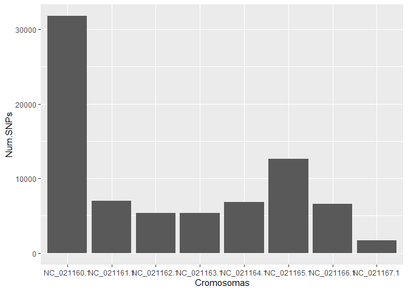
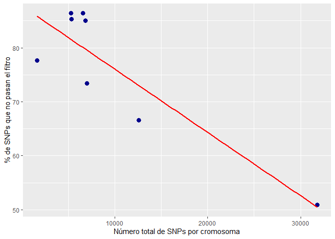

 Informe NILs

================
Adrián Pérez Rial <z12peria@uco.es>
2025-12-04

<!-- Antes de comenzar !!!
debes crear el archivo con las referencias de R y los paquetes que vayas a utilizar.  
Puedes actualizar el archivo en cualquier momento, sólo copia en la terminal el siguiente código y añade el nuevo paquete a la lista, se creará un nuevo archivo con las referencias en el formato adecuado "BibTeX". De forma automática incluye la referencia de R-->

<!-- knitr::write_bib(c(.packages(), 'dplyr', 'ggplot2', 'knitr', 'tinytex'), 'libraries.bib') -->

<!-- Inicio Rmd -->

<!-- Configuración global de los bloques de código, `echo = TRUE` -> todo el código utilizado en este documento aparecerá en el documento final salvo que se expecifique lo contrario, a excepción de este bloque de código, `include=TRUE`  -->

<!-- cargar las librerias que vamos a utilizar, queremos que el código se ejecute, pero no que aparezca en el documento final, también excluímos los avisos y mensajes -->

<!-- Para generar títulos, subtítulos etc se usa # el número de # determina el estilo y el formato del texto -->

# Introducción

## El trabajo seleccionado

<!-- Trabajamos los diferentes estilos de text (negrita, cursiva, tachado, superíndice y subíndice), notas a pie de página [^N], citas > y referencias [@código] -->

<!-- En HTML podemos usar la etiqueda de css para usar diferentes colores en el texto:  -->

<!--  -->

Vamos a trabajar con los datos de ([Perez-Rial et al.
2024](#ref-perez2024phenotypic)). Este trabajo describe
genes candidatos de la floración en
garbanzo (*Cicer arietinum*) como
*MED16*, *BBX24* o *ELF3*, este último también reportado por otros
estudios como ([Ridge et al. 2017](#ref-ridge_chickpea_2017)). Los
mecanismos básicos de floración estudiados en la planta modelo
Arabidopsis thaliana están conservados en las leguminosas (([James L.
Weller and Macknight 2019](#ref-weller_genetic_2019); [Hecht et al.
2005](#ref-hecht_conservation_2005); [James L. Weller and Ortega
2015](#ref-weller_genetic_2015))), exceptuando ciertos genes como
*CONSTANS* ([Wong et al. 2014](#ref-wong_isolation_2014)).

## Los datos

<!-- Leer los datos desde el fichero que está en la misma carpeta que Rmarkdown. Si el fichero está en otra carpeta actualizar la localización del archivo -->

<!-- Links a páginas/archivos externos   -->

Los datos de este proyecto fueron descargados desde [NILs
Adrián](https://bmcplantbiol.biomedcentral.com/articles/10.1186/s12870-024-05411-y).

<!-- Primera vista de los datos -->

| CHROM | POS | ID | REF | ALT | NF10/82-L | NF10/82-E | QUAL | FILTER | INFO | FORMAT |
|:--:|:--:|:--:|:--:|:--:|:--:|:--:|:--:|:--:|:--:|:--:|
| NC_021160.1 | 72 | . | T | C,G | 0/1 | 1/2 | 2117.19 | PASS | AC=2,1;AF=0.500,0.250;AN=4;ANN=C\|downstream_gene_variant\|MODIFIER\|exon-XR_001143330.2-1\|GENE_exon-XR_001143330.2-1\|transcript\|rna-XR_001143330.2\|pseudogene\|\|n.*169A\>G\|\|\|\|\|169\|,G\|downstream_gene_variant\|MODIFIER\|exon-XR_001143330.2-1\|GENE_exon-XR_001143330.2-1\|transcript\|rna-XR_001143330.2\|pseudogene\|\|n.*169A\>C\|\|\|\|\|169\|,C\|intergenic_region\|MODIFIER\|exon-XR_001143330.2-1\|GENE_exon-XR_001143330.2-1\|intergenic_region\|GENE_exon-XR_001143330.2-1\|\|\|n.72T\>C\|\|\|\|\|\|,G\|intergenic_region\|MODIFIER\|exon-XR_001143330.2-1\|GENE_exon-XR_001143330.2-1\|intergenic_region\|GENE_exon-XR_001143330.2-1\|\|\|n.72T\>G\|\|\|\|\|\|;BaseQRankSum=-3.993e+00;ClippingRankSum=0.00;DP=132;ExcessHet=3.0103;FS=7.468;MLEAC=2,1;MLEAF=0.500,0.250;MQ=42.94;MQRankSum=-2.035e+00;QD=18.74;ReadPosRankSum=1.20;SOR=0.208;SAL5=2;SAL10=2;SAL15=2;SAL20=2;SAL30=2;SAL40=2;SAL50=2 | GT:AD:DP:GQ:PL |
| NC_021160.1 | 126 | . | TA | T | 0/0 | 0/1 | 79.83 | QD2 | AC=1;AF=0.250;AN=4;ANN=T\|downstream_gene_variant\|MODIFIER\|exon-XR_001143330.2-1\|GENE_exon-XR_001143330.2-1\|transcript\|rna-XR_001143330.2\|pseudogene\|\|n.\*114delT\|\|\|\|\|114\|,T\|intergenic_region\|MODIFIER\|exon-XR_001143330.2-1\|GENE_exon-XR_001143330.2-1\|intergenic_region\|GENE_exon-XR_001143330.2-1\|\|\|n.127delA\|\|\|\|\|\|;BaseQRankSum=-1.883e+00;ClippingRankSum=0.00;DP=313;ExcessHet=3.9794;FS=5.326;MLEAC=2;MLEAF=0.500;MQ=56.41;MQRankSum=-5.369e+00;QD=0.66;ReadPosRankSum=-1.808e+00;SOR=0.182;SAL5=2;SAL10=2;SAL15=2;SAL20=2;SAL30=2;SAL40=2;SAL50=2 | GT:AD:DP:GQ:PL |
| NC_021160.1 | 161 | . | G | A | 0/0 | 0/1 | 22.21 | QD2 | AC=1;AF=0.250;AN=4;ANN=A\|downstream_gene_variant\|MODIFIER\|exon-XR_001143330.2-1\|GENE_exon-XR_001143330.2-1\|transcript\|rna-XR_001143330.2\|pseudogene\|\|n.\*80C\>T\|\|\|\|\|80\|,A\|intergenic_region\|MODIFIER\|exon-XR_001143330.2-1\|GENE_exon-XR_001143330.2-1\|intergenic_region\|GENE_exon-XR_001143330.2-1\|\|\|n.161G\>A\|\|\|\|\|\|;BaseQRankSum=3.05;ClippingRankSum=0.00;DP=418;ExcessHet=3.0103;FS=29.583;MLEAC=1;MLEAF=0.250;MQ=53.42;MQRankSum=-4.827e+00;QD=0.13;ReadPosRankSum=2.02;SOR=2.047;SAL5=2;SAL10=2;SAL15=2;SAL20=2;SAL30=2;SAL40=2;SAL50=2 | GT:AD:DP:GQ:PGT:PID:PL |
| NC_021160.1 | 450 | . | G | A | 0/0 | 0/1 | 50.19 | QD2 | AC=1;AF=0.250;AN=4;ANN=A\|intragenic_variant\|MODIFIER\|LOC101497325\|gene-LOC101497325\|gene_variant\|gene-LOC101497325\|\|\|n.450G\>A\|\|\|\|\|\|,A\|non_coding_transcript_exon_variant\|MODIFIER\|exon-XR_001143330.2-1\|GENE_exon-XR_001143330.2-1\|transcript\|rna-XR_001143330.2\|pseudogene\|3/3\|n.310C\>T\|\|\|\|\|\|;BaseQRankSum=3.69;ClippingRankSum=0.00;DP=161;ExcessHet=3.0103;FS=48.565;MLEAC=1;MLEAF=0.250;MQ=56.46;MQRankSum=0.268;QD=0.63;ReadPosRankSum=0.049;SOR=5.892;SAL5=2;SAL10=2;SAL15=2;SAL20=2;SAL30=2;SAL40=2;SAL50=2 | GT:AD:DP:GQ:PL |
| NC_021160.1 | 1942 | . | C | A | 0/1 | 1/1 | 1162.33 | MQ40;map;mrd30 | AC=3;AF=0.750;AN=4;ANN=A\|upstream_gene_variant\|MODIFIER\|exon-XR_001143330.2-1\|GENE_exon-XR_001143330.2-1\|transcript\|rna-XR_001143330.2\|pseudogene\|\|n.-960G\>T\|\|\|\|\|960\|,A\|intergenic_region\|MODIFIER\|exon-XR_001143330.2-1-exon-XR_001143419.2-1\|GENE_exon-XR_001143330.2-1-GENE_exon-XR_001143419.2-1\|intergenic_region\|GENE_exon-XR_001143330.2-1-GENE_exon-XR_001143419.2-1\|\|\|n.1942C\>A\|\|\|\|\|\|;BaseQRankSum=3.03;ClippingRankSum=0.00;DP=61;ExcessHet=3.0103;FS=1.436;MLEAC=3;MLEAF=0.750;MQ=36.83;MQRankSum=-1.360e-01;QD=19.05;ReadPosRankSum=0.477;SOR=0.364;SAL5=2;SAL10=2;SAL15=2;SAL20=2;SAL30=1;SAL40=0;SAL50=0 | GT:AD:DP:GQ:PL |
| NC_021160.1 | 4132 | . | G | T | 0/0 | 0/1 | 89.19 | QD2 | AC=1;AF=0.250;AN=4;ANN=T\|upstream_gene_variant\|MODIFIER\|exon-XR_001143330.2-1\|GENE_exon-XR_001143330.2-1\|transcript\|rna-XR_001143330.2\|pseudogene\|\|n.-3150C\>A\|\|\|\|\|3150\|,T\|intergenic_region\|MODIFIER\|exon-XR_001143330.2-1-exon-XR_001143419.2-1\|GENE_exon-XR_001143330.2-1-GENE_exon-XR_001143419.2-1\|intergenic_region\|GENE_exon-XR_001143330.2-1-GENE_exon-XR_001143419.2-1\|\|\|n.4132G\>T\|\|\|\|\|\|;BaseQRankSum=-5.200e-01;ClippingRankSum=0.00;DP=136;ExcessHet=3.0103;FS=0.000;MLEAC=1;MLEAF=0.250;MQ=57.11;MQRankSum=-6.841e+00;QD=1.27;ReadPosRankSum=-7.000e-02;SOR=0.717;SAL5=2;SAL10=2;SAL15=2;SAL20=2;SAL30=2;SAL40=2;SAL50=2 | GT:AD:DP:GQ:PGT:PID:PL |
| NC_021160.1 | 4147 | . | G | C | 0/0 | 0/1 | 82.19 | QD2 | AC=1;AF=0.250;AN=4;ANN=C\|upstream_gene_variant\|MODIFIER\|exon-XR_001143330.2-1\|GENE_exon-XR_001143330.2-1\|transcript\|rna-XR_001143330.2\|pseudogene\|\|n.-3165C\>G\|\|\|\|\|3165\|,C\|intergenic_region\|MODIFIER\|exon-XR_001143330.2-1-exon-XR_001143419.2-1\|GENE_exon-XR_001143330.2-1-GENE_exon-XR_001143419.2-1\|intergenic_region\|GENE_exon-XR_001143330.2-1-GENE_exon-XR_001143419.2-1\|\|\|n.4147G\>C\|\|\|\|\|\|;BaseQRankSum=0.265;ClippingRankSum=0.00;DP=131;ExcessHet=3.0103;FS=0.000;MLEAC=1;MLEAF=0.250;MQ=57.77;MQRankSum=-6.336e+00;QD=1.23;ReadPosRankSum=-6.480e-01;SOR=0.602;SAL5=2;SAL10=2;SAL15=2;SAL20=2;SAL30=2;SAL40=2;SAL50=2 | GT:AD:DP:GQ:PGT:PID:PL |
| NC_021160.1 | 6539 | . | C | A | 0/1 | 0/0 | 226.19 | PASS | AC=1;AF=0.250;AN=4;ANN=A\|intergenic_region\|MODIFIER\|exon-XR_001143330.2-1-exon-XR_001143419.2-1\|GENE_exon-XR_001143330.2-1-GENE_exon-XR_001143419.2-1\|intergenic_region\|GENE_exon-XR_001143330.2-1-GENE_exon-XR_001143419.2-1\|\|\|n.6539C\>A\|\|\|\|\|\|;BaseQRankSum=1.29;ClippingRankSum=0.00;DP=170;ExcessHet=3.0103;FS=22.385;MLEAC=1;MLEAF=0.250;MQ=57.27;MQRankSum=-6.478e+00;QD=2.41;ReadPosRankSum=-9.470e-01;SOR=4.461;SAL5=2;SAL10=2;SAL15=2;SAL20=2;SAL30=2;SAL40=2;SAL50=2 | GT:AD:DP:GQ:PL |

Tabla 1: Diez primeras filas

<!-- El código R en línea -->

Los datos tienen 120441 filas y 11 columnas.

Cada fila se corresponde con un SNP, por tanto, hay 120441 SNPs.

<!-- Filtra los datos para quedarte solo con los cromosomas (sus códigos empiezan por NC_) -->

Del total de SNPs detectados, 77170 se corresponden con SNPs situados en
cromosomas (Figura 1).

<!-- Calcula el número de SNPs por cromosoma que tiene el garbanzo con la función `count` y guarda los datos ordenados de forma descendiente en variable nueva -->

<!-- Utilizar la variable nueva para hacer un gráfico de barras incluyendo el pie de figura y la posición -->

Figura 1. Número de SNPs por cromosomas

## Hipótesis

Nuestra hipótesis es que los cromosomas con mayor número de SNPs
presentan mayor % de SNPs que no pasan el filtro de calidad

------------------------------------------------------------------------

# Materiales y Methods

<!-- Para indicar una referencia se utiliza [@codigo] -->

Para llevar a cabo el análisis usamos R ([R Core Team
2022](#ref-R-base)) con las librerias dplyr ([Wickham et al.
2023](#ref-R-dplyr)) y ggplot ([Wickham et al. 2025](#ref-R-ggplot2);
[Wickham 2016](#ref-ggplot22016)). Para la creación de este informe
hemos utilizado el paquete knitr ([Xie 2023](#ref-R-knitr),
[2015](#ref-knitr2015), [2014](#ref-knitr2014)) y pandoc.

------------------------------------------------------------------------

# Resultados

<!-- Selecciona del dataset `Data` únicamente las columnas **CHROM**, **POS** y **FILTER**.   -->

<!-- Crea una nueva variable en la que todo valor distinto de *PASS* se transforme en *NOT_PASS*.   -->

## Cálculo de porcentajes por cromosoma

El procentaje de SNPs que no pasan el filtro se muentra en la Tabla 2.

| CHROM       | total_SNPs | not_pass | porcentaje_not_pass |
|:------------|-----------:|---------:|:--------------------|
| NC_021160.1 |      31790 |    16175 | 50.9%               |
| NC_021161.1 |       7012 |     5147 | 73.4%               |
| NC_021162.1 |       5311 |     4591 | 86.4%               |
| NC_021163.1 |       5371 |     4580 | 85.3%               |
| NC_021164.1 |       6843 |     5814 | 85%                 |
| NC_021165.1 |      12594 |     8388 | 66.6%               |
| NC_021166.1 |       6598 |     5699 | 86.4%               |
| NC_021167.1 |       1651 |     1283 | 77.7%               |

Tabla 2. Porcentaje de SNPs que pasan y no pasan el filtro por cromosoma

## Representación gráfica

El siguiente modelo muestra la relación entre el número total y los SNPs
no filtrados (Figura 2).

<figure>

<figcaption aria-hidden="true">Fig 2. Relación entre el número total de
SNPs y el porcentaje de SNPs que no pasan el filtro de
calidad</figcaption>
</figure>

El coeficiente de correlación es -0.88

------------------------------------------------------------------------

# Conclusiones

Los datos NO apoyan nuestra hipótesis. Es la contraria: los cromosomas
en los que se detectan menos SNPs, presentan mayor porcentaje de SNPs
que no pasan el filtro.

------------------------------------------------------------------------

<!-- Para asegurar la reproducibilidad de los resultados es necesario conocer el sistema operativo y la version de software y paquetes -->

# Información de la sesión y referencias

    ## R version 4.5.2 (2025-10-31 ucrt)
    ## Platform: x86_64-w64-mingw32/x64
    ## Running under: Windows 11 x64 (build 26200)
    ## 
    ## Matrix products: default
    ##   LAPACK version 3.12.1
    ## 
    ## locale:
    ## [1] LC_COLLATE=Spanish_Spain.utf8  LC_CTYPE=Spanish_Spain.utf8   
    ## [3] LC_MONETARY=Spanish_Spain.utf8 LC_NUMERIC=C                  
    ## [5] LC_TIME=Spanish_Spain.utf8    
    ## 
    ## time zone: Europe/Madrid
    ## tzcode source: internal
    ## 
    ## attached base packages:
    ## [1] stats     graphics  grDevices utils     datasets  methods   base     
    ## 
    ## other attached packages:
    ## [1] readxl_1.4.5  ggplot2_4.0.0 dplyr_1.1.4  
    ## 
    ## loaded via a namespace (and not attached):
    ##  [1] vctrs_0.6.5        nlme_3.1-168       cli_3.6.5          knitr_1.50        
    ##  [5] rlang_1.1.6        xfun_0.54          generics_0.1.4     S7_0.2.0          
    ##  [9] labeling_0.4.3     glue_1.8.0         htmltools_0.5.8.1  scales_1.4.0      
    ## [13] rmarkdown_2.30     cellranger_1.1.0   grid_4.5.2         evaluate_1.0.5    
    ## [17] tibble_3.3.0       fastmap_1.2.0      yaml_2.3.10        lifecycle_1.0.4   
    ## [21] compiler_4.5.2     RColorBrewer_1.1-3 pkgconfig_2.0.3    mgcv_1.9-3        
    ## [25] rstudioapi_0.17.1  lattice_0.22-7     farver_2.1.2       digest_0.6.37     
    ## [29] R6_2.6.1           tidyselect_1.2.1   splines_4.5.2      pillar_1.11.1     
    ## [33] magrittr_2.0.4     Matrix_1.7-4       withr_3.0.2        tools_4.5.2       
    ## [37] gtable_0.3.6

Hecht, Valérie, Fabrice Foucher, Cristina Ferrándiz, Richard Macknight,
Cristina Navarro, Julie Morin, Megan E Vardy, et al. 2005. “Conservation
of Arabidopsis Flowering Genes in Model Legumes.” *Plant Physiology* 137
(4): 1420–34. <https://doi.org/10.1104/pp.104.057018>.

Perez-Rial, Adrian, Alejandro Carmona, Latifah Ali, Josefa Rubio, Teresa
Millan, Patricia Castro, and Jose V Die. 2024. “Phenotypic and Genetic
Characterization of a Near-Isogenic Line Pair: Insights into Flowering
Time in Chickpea.” *BMC Plant Biology* 24 (1): 709.
<https://doi.org/10.1186/s12870-024-05411-y>.

R Core Team. 2022. *R: A Language and Environment for Statistical
Computing*. Vienna, Austria: R Foundation for Statistical Computing.
<https://www.R-project.org/>.

Ridge, Stephen, Amit Deokar, Robyn Lee, Ketema Daba, Richard C
Macknight, James L Weller, and Bunyamin Tar’an. 2017. “The Chickpea
Early Flowering 1 (Efl1) Locus Is an Ortholog of Arabidopsis ELF3.”
*Plant Physiology* 175 (2): 802–15.
<https://doi.org/10.1104/pp.17.00082>.

Weller, James L., and Richard C. Macknight. 2019. “Genetic Control of
Flowering Time in Legumes.” In *The Model Legume Medicago Truncatula*,
edited by Frans de Brujin, 1st ed., 182–88.

Weller, James L, and Raúl Ortega. 2015. “Genetic Control of Flowering
Time in Legumes.” *Frontiers in Plant Science* 6 (April): 207.
<https://doi.org/10.3389/fpls.2015.00207>.

Wickham, Hadley. 2016. *Ggplot2: Elegant Graphics for Data Analysis*.
Springer-Verlag New York. <https://ggplot2.tidyverse.org>.

Wickham, Hadley, Winston Chang, Lionel Henry, Thomas Lin Pedersen,
Kohske Takahashi, Claus Wilke, Kara Woo, Hiroaki Yutani, Dewey
Dunnington, and Teun van den Brand. 2025. *Ggplot2: Create Elegant Data
Visualisations Using the Grammar of Graphics*.
<https://ggplot2.tidyverse.org>.

Wickham, Hadley, Romain François, Lionel Henry, Kirill Müller, and Davis
Vaughan. 2023. *Dplyr: A Grammar of Data Manipulation*.
<https://dplyr.tidyverse.org>.

Wong, Albert C S, Valérie F G Hecht, Kelsey Picard, Payal Diwadkar,
Rebecca E Laurie, Jiangqi Wen, Kirankumar Mysore, Richard C Macknight,
and James L Weller. 2014. “Isolation and Functional Analysis of
CONSTANS-LIKE Genes Suggests That a Central Role for CONSTANS in
Flowering Time Control Is Not Evolutionarily Conserved in Medicago
Truncatula.” *Frontiers in Plant Science* 5 (September): 486.
<https://doi.org/10.3389/fpls.2014.00486>.

Xie, Yihui. 2014. “Knitr: A Comprehensive Tool for Reproducible Research
in R.” In *Implementing Reproducible Computational Research*, edited by
Victoria Stodden, Friedrich Leisch, and Roger D. Peng. Chapman;
Hall/CRC.

———. 2015. *Dynamic Documents with R and Knitr*. 2nd ed. Boca Raton,
Florida: Chapman; Hall/CRC. <https://yihui.org/knitr/>.

———. 2023. *Knitr: A General-Purpose Package for Dynamic Report
Generation in r*. <https://yihui.org/knitr/>.

